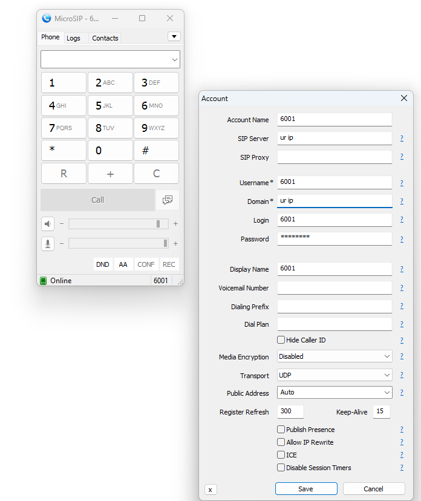
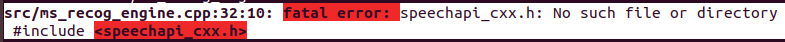
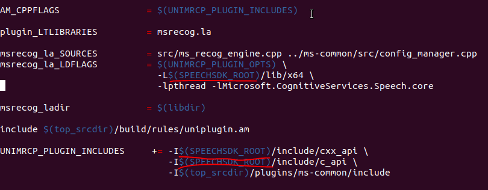

# Manual de instalação do ambiente de Lab (para já em WSL ou VM)
 
Neste lab, depois de instalado o utilizador terá ao seu dispor um servidor de [Asterisk](https://docs.asterisk.org/Getting-Started/Beginning-Asterisk/) e de [Unimrcp](https://www.unimrcp.org/index.php/solutions/server).
Em seguida o utilizador irá proceder á modificação dos ficheiros de configuração para que os plugins de Regogn (Speech to text) e Synth (Text to speech) possam ser utilizados.
Adicionalmente o utilizador será ainda convidado a instalar um cliente de SIP

> Os plugins que fazem o TTS (text to speech) e STT (speech to text) utilizam a API de Cognitive Services da Microsoft [MS Speech Documentation](https://learn.microsoft.com/en-us/azure/ai-services/speech-service/)

## Instalação de Requisitos em WSL ou numa VM (num futuro próximo tudo será em docker) 

>A versão do Ubuntu deverá ser **18.04** (wsl --install -d ubuntu=18.04) - [Ubuntu wsl](https://ubuntu.com/tutorials/install-ubuntu-on-wsl2-on-windows-10#3-download-ubuntu) 

Depois de instalado o Ubuntu, atualizar o gestor de dependências.

```sudo apt update```

Instalar dependências no path **/usr/src** 

```cd /usr/src```

```sudo apt install -y dmidecode g++ libncurses5-dev libxml2-dev make wget libssl-dev libnewt-dev libsqlite3-dev uuid-dev libgtk2.0-dev libjansson-dev binutils-dev libtool libjansson-dev```

```sudo apt install build-essential libssl1.0.0 libasound2 wget```

```sudo apt install pkg-config automake libtool libtool-bin```

```sudo apt install libpoco-dev rapidjson-dev```

## Instalação do Asterisk

No diretório atual continuar com a instalação do Asterisk 

>Nota: o asterisk será o responsável por estabelecer as comunicações entre o ciente (soft phone) e o servidor de UniMRCP

Download do Asterisk 

```sudo wget https://downloads.asterisk.org/pub/telephony/asterisk/releases/asterisk-13.18.3.tar.gz```

Depois de feito o download, extrair o conteudo do ficheiro **asterisk-13.18.3.tar.gz** 

```sudo tar xvfz asterisk-13.18.3.tar.gz```

Iniciar a configuração do Asterisk

```cd asterisk-13.18.3```

```sudo ./configure --with-pjproject-bundled --libdir=/usr/lib64```

Validar a instalação do menuselect  - [mais info menuselect](http://www.asteriskdocs.org/en/2nd_Edition/asterisk-book-html-chunk/I_sect13_tt243.html) 

``` $sudo make menuselect``` 

Compilar

```sudo make```

```sudo make install```

```sudo make samples```

## Configuração dos settings do Asterisk

Configuração das credenciais do user no Asterisk

**Mudar de diretoria**

```cd /etc/asterisk```

Editar o ficheiro pjsip.conf

```sudo nano pjsip.conf```

>Dica: no nano utilizar **Ctrl+w** para procurar por uma palavra e desta forma econtrar mais rápido o que se procura

Procurar no ficheiro **pjsip** este segmento:

```
[transport-udp]              
;type=transport
;protocol=udp    ;udp,tcp,tls,ws,wss
;bind=0.0.0.0
```

Modificar a configuração anterior, descomentando as linhas retirando o '**;**'.

```
[transport-udp]                          
type=transport
protocol=udp    ;udp,tcp,tls,ws,wss
bind=0.0.0.0
```

Ainda no mesmo ficheiro ir para a secção.

```
;[6001]
;type=endpoint
;transport=transport-udp
;context=public
;disallow=all
...
```

Descomentar as linhas de forma a que fique com a seguinte configuração:

```
[6001]
type=endpoint
;transport=transport-udp      
context=public  
disallow=all
allow=ulaw
auth=6001
aors=6001
```

> A linha 'transport' continua comentada e o context garantir que fica '**public**'

Mais abaixo, definir o utilizador e a password que depois serão utilizados no softphone.

```
;[6001]
;type=auth
;auth_type=userpass
;password=6001
;username=6001
```

Descomentar as linhas (opcional: substituir a '**password**').

```
[6001]
type=auth
auth_type=userpass
password=password         
username=6001
```

Em seguida manter a linha '**contact**' comentada neste segmento.

```
;[6001]
;type=aor
;max_contacts=1
;contact=sip:6001@172.23.211.81
```

```
[6001]
type=aor
max_contacts=1
;contact=sip:6001@172.23.211.81   
```

Guardar e sair.

**Editar o ficheiro modules.conf**

```sudo nano modules.conf```

No fim do documento há este segmento.

```
noload => chan_alsa.so
;noload => chan_oss.so
noload => chan_console.so
;
```

Adicionar a linha para fazer load do **pjsip**.

```
noload => chan_alsa.so
;noload => chan_oss.so
noload => chan_console.so
load => res_pjsip.so
;
```

Guardar e sair.

**Editar o ficheiro extensions.conf**

```sudo nano extensions.conf```

Procurar '**[public]**'.

```
include => demo
```

Comentar esta linha.

```
;include => demo
```

Adicionar uma extensão para testar a ligação entre o Asterisk e o soft phone.

```
exten = 100,1,Goto(hello-world,s,1)
 
[hello-world]
exten = s,1,Answer()
same = n,Wait(1)
same = n,Playback(hello-world)
same = n,Hangup()
```

> A extensão número '100' é redirecionada para o dialplan 'hello-world': a chamada é atendida, há um segundo de silêncio, o Asterisk toca o som do ficheiro especificado na função 'Playback', e desliga a chamada.

> 'hello-word' refere-se a um dos ficheiros de som incluídos na instalação do Asterisk (/var/lib/asterisk/sounds/en/hello-world.gsm).

Guardar e sair.

Copiar libs para o sítio onde devem estar, como medida de precaução.

```sudo cp /usr/lib64/libasteriskssl.so.1 /usr/lib/x86_64-linux-gnu```

```sudo cp /usr/lib64/libasteriskpj.so.2 /usr/lib/x86_64-linux-gnu```

Verificar se está tudo bem.

```sudo service asterisk start``` *<-- Começar o serviço*

```sudo asterisk -rvvv``` *<-- Entrar na consola do Asterisk*

Se aparecer o CLI, está a funcionar.

## Instalação do soft phone e testar a ligação SP -> Asterisk

É preciso instalar um soft phone para fazer a ligação com o Asterisk. Teoricamente, qualquer soft phone que tenha SIP dá, mas o MicroSIP é mais acessível.

https://www.microsip.org/downloads *(a versão normal, **não** lite, é aconselhada)*

Instalar e abrir o MicroSIP, clicar na seta à direita de 'Contacts' e selecionar 'Edit account'. Configurar a account como na imagem em baixo.



> Atenção: 'Media Encryption' tem que estar 'disabled'.

Voltar a iniciar o Asterisk, entrar na consola, e ligar para o número '100'. Se estiver tudo bem, a extensão definida antes deve correr.

## Instalação do UniMRCP

Instalar dependências do UniMRCP (para unimrcp-1.8.0 usar unimrcp-deps-1.6.0 (versão estável))

> Mais info: http://downloads.asterisk.org/pub/telephony/asterisk/releases/

```cd /usr/src```

```sudo wget https://www.unimrcp.org/project/component-view/unimrcp-deps-1-6-0-tar-gz/download -O unimrcp-deps-1.6.0.tar.gz```

```sudo tar -xzvf unimrcp-deps-1.6.0.tar.gz```

```cd unimrcp-deps-1.6.0```

```sudo ./build-dep-libs.sh```

```cd ..```

Dar set up do sdk do Azure. É preciso primeiro declarar uma variável global.

```sudo nano /etc/environment```

Acrescentar a seguinte linha:

```
SPEECHSDK_ROOT="/usr/src/speechsdk"
```

Guardar e sair.

```sudo wget -O SpeechSDK-Linux.tar.gz https://aka.ms/csspeech/linuxbinary```

```sudo tar --strip 1 -xzf SpeechSDK-Linux.tar.gz -C "$SPEECHSDK_ROOT"```

### Instalar o UniMRCP 1.8.0

> Mais info: https://www.unimrcp.org/project/component-view/unimrcp/unimrcp-1-8-0-tar-gz

```sudo wget https://www.unimrcp.org/project/component-view/unimrcp-1-8-0-tar-gz/download -O unimrcp-1.8.0.tar.gz```

```sudo tar -xzvf unimrcp-1.8.0.tar.gz```

> O passo seguinte assume que o git está instalado.

```sudo git clone https://github.com/MiguelChen17/plugins.git```

**ou**

```sudo git clone git@github.com:accelerat-ai/unimrcp-plugin-azure-speech.git```

Copiar os plugins para dentro do unimrcp-1.8.0.

```sudo cp -r plugins/ms-common/ unimrcp-1.8.0/plugins/```

```sudo cp -r plugins/ms-synth/ unimrcp-1.8.0/plugins/```

```sudo cp -r plugins/ms-recog/ unimrcp-1.8.0/plugins/```

### Set up e compilação dos plugins.

```cd unimrcp-1.8.0/plugins```

Mudar o **Makefile.am** do ficheiro plugins 

```sudo nano Makefile.am```

Acrescentar o seguinte (atenção aos espaços):

```
if MSRECOG_PLUGIN
SUBDIRS       += ms-recog
endif

if MSSYNTH_PLUGIN
SUBDIRS       += ms-synth
endif
```

Guardar e sair.

```cd ..```

Mudar o **configure.ac**

```sudo nano configure.ac```

Procurar 'dnl recorder plugin' e adicionar depois desse bloco:

```
dnl MS recognizer plugin.
UNI_PLUGIN_ENABLED(msrecog)
 
AM_CONDITIONAL([MSRECOG_PLUGIN],[test "${enable_msrecog_plugin}" = "yes"])
 
dnl MS synthesizer plugin.
UNI_PLUGIN_ENABLED(mssynth)

AM_CONDITIONAL([MSSYNTH_PLUGIN],[test "${enable_mssynth_plugin}" = "yes"])
```

Dentro do AC_CONFIG_FILES por:

```
plugins/ms-recog/Makefile
plugins/ms-synth/Makefile
```

No fim do AC_OUTPUT:

```
echo Installation layout........... : $layout_name
echo Installation directory........ : $prefix
echo
echo '********************************************************************'
```

Adicionar:

```
echo Installation layout........... : $layout_name
echo Installation directory........ : $prefix
echo MS recognizer plugin.......... : $enable_msrecog_plugin   <-----
echo MS synthesizer plugin......... : $enable_mssynth_plugin   <-----
echo
echo '********************************************************************'
```

Guardar e sair.

```sudo ./bootstrap```

```sudo ./configure --with-apr=/usr/local/apr --with-apr-util=/usr/local/apr```

```sudo make```

***

**Se no 'make' der este erro:**



**tem que se editar os Makefiles.am dos plugins.**

```sudo nano plugins/ms-synth/Makefile.am```

Trocar todas as instâncias de '$(SPEECHSDK_ROOT)' por "/usr/src/speechsdk":



Guardar, sair e fazer o mesmo para:

```sudo nano plugins/ms-recog/Makefile.am```

***

(Continuação)

```sudo make install```

> Local da instalação: /usr/local/unimrcp

```sudo ldconfig```

```export LD_LIBRARY_PATH="$LD_LIBRARY_PATH:$SPEECHSDK_ROOT/lib/x64"```

```cd ..```

### Instalar o módulo de unimrcp-asterisk

> Mais info: https://www.unimrcp.org/project/component-view/asterisk/asterisk-unimrcp-1-10-0-tar-gz

```sudo wget https://www.unimrcp.org/project/component-view/asterisk-unimrcp-1-10-0-tar-gz/download -O unimrcp-asterisk-1.10.0.tar.gz```

```sudo tar -xzvf unimrcp-asterisk-1.10.0.tar.gz ```

```cd asterisk-unimrcp-1.10.0/```

```sudo ./bootstrap```

```sudo ./configure --prefix=/usr/lib64/asterisk/modules --with-asterisk-version=13.18.3```

```sudo make```

```sudo make install```

### Verificar se está tudo bem

Iniciar o Asterisk.

```sudo service asterisk start```

**ou, se já estiver iniciado:**

```sudo service asterisk restart```

```sudo asterisk -rvvv```

***
 **Se aparecer - 'error While loading shared libraries: libasteriskssl.so.1: cannot open shared object file: …'**

```sudo cp /usr/lib64/libasteriskssl.so.1 /usr/lib/x86_64-linux-gnu```

```sudo cp /usr/lib64/libasteriskpj.so.2 /usr/lib/x86_64-linux-gnu```

```sudo cp /usr/src/speechsdk/lib/x64/libMicrosoft.CognitiveServices.Speech.core.so /usr/lib```

```sudo service asterisk restart```

```sudo asterisk -rvvv```
***

Dentro da consola do Asterisk:

```>module show like unimrcp```

Tem de aparecer dois módulos:

| Module                | Description                | Use Count | Status  | Support Level |
|-----------------------|----------------------------|-----------|---------|---------------|
| app_unimrcp.so        | MRCP suite of applications | 0         | Running | unknown       |
| res_speech_unimrcp.so | UniMRCP Speech Engine      | 0         | Running | core          |

2 modules loaded

```>exit```

## Testar a ligação Asterisk -> UniMRCP

### Adicionar outras extensões

```sudo /etc/asterisk/extensions.conf```

Procurar '[public]' e adicionar:

```
exten = 100,1,Goto(hello-world,s,1)
exten = 101,1,Goto(mrcp-tts-test,s,1)   <-----
exten = 102,1,Goto(mrcp-asr-test,s,1)   <-----

[hello-world]
exten = s,1,Answer()
same = n,Wait(1)
same = n,Playback(hello-world)
same = n,Hangup()

[mrcp-tts-test]
exten = s,1,Answer()
same = n,Wait(1)
same = n,MRCPSynth(hello my name is devscope, p=default)   <-----
same = n,Verbose(1, ${SYNTHSTATUS})
same = s,n,Hangup()
 
[mrcp-asr-test]   
exten = s,1,Answer()
same = n,Wait(1)
same = n,MRCPRecog("builtin:grammar/freeform",t=5000&b=1&ct=0.7&f=beep)        <-----
same = n,Verbose(1,Status is: ${RECOGSTATUS} and Result is: ${RECOG_RESULT})
same = s,n,Hangup()
```

Guardar e sair.

Editar o **pjsip.conf**

```sudo /etc/asterisk/pjsip.conf```

Procurar a segunda ocorrência de '[6001]' e editar:

```
[6001]
type=endpoint
;transport=transport-udp
context=public
disallow=all
allow=g722   <-----
allow=ulaw
auth=6001
aors=6001
```

Guardar e sair.

Apagar o **mrcp.conf** e criar ficheiro em branco.

```sudo rm /etc/asterisk/mrcp.conf```

```sudo nano /etc/asterisk/mrcp.conf```

Escrever:

```
[general]
; Default ASR and TTS profiles.
default-asr-profile = speech-unimrcp-mrcp2
default-tts-profile = speech-unimrcp-mrcp2
 
; UniMRCP logging level to appear in Asterisk logs.  Options are:
; EMERGENCY|ALERT|CRITICAL|ERROR|WARNING|NOTICE|INFO|DEBUG -->
log-level = DEBUG
max-connection-count = 100
max-shared-count = 100
offer-new-connection = 1
; rx-buffer-size = 1024
; tx-buffer-size = 1024
; request-timeout = 5000
; speech-channel-timeout = 30000
 
;
; Profile for unimrcp Server MRCPv2
;
 
[speech-unimrcp-mrcp2]
; MRCP version.
version = 2
; === SIP settings ===; Must be set to the IP address of the MRCP server.
server-ip = 127.0.0.1
; SIP port on the MRCP server.
server-port = 8066
; server-username = test
force-destination = 1
; === SIP agent ===
; client-ip = 0.0.0.0
; Must be set to the IP address of the MRCP client.
client-ip = 127.0.0.1
; client-ext-ip = auto
; SIP port on the MRCP client.
client-port = 8068
; SIP transport either UDP or TCP.
sip-transport = udp
; ua-name = Asterisk
; sdp-origin = Asterisk
; sip-t1 = 500
; sip-t2 = 4000
; sip-t4 = 4000
; sip-t1x64 = 32000
; sip-timer-c = 185000
; === RTP factory ===
; rtp-ip = 0.0.0.0
; Must be set to the IP address of the MRCP client.
rtp-ip = 127.0.0.1
; rtp-ext-ip = auto
; RTP port range on the MRCP client.
rtp-port-min = 4000
rtp-port-max = 5000
; === Jitter buffer settings ===
playout-delay = 50
; min-playout-delay = 20
max-playout-delay = 200
; === RTP settings ===
ptime = 20
;codecs = PCMU PCMA L16/96/8000 telephone-event/101/8000
codecs = G722 PCMU/97/16000 PCMA/98/16000 L16/99/16000 PCMU PCMA L16/96/8000 telephone-event/101/8000
; === RTCP settings ===
rtcp = 1
rtcp-bye = 2
rtcp-tx-interval = 5000
rtcp-rx-resolution = 1000
```

Guardar e sair.

Editar o **res-speech-unimrcp.conf**.

```sudo nano /etc/asterisk/res-speech-unimrcp.conf```

Descomentar a linha com 'unimrcp-profile = uni2', se ainda não estiver.

```
[general]
; UniMRCP named profile. Options are:;
unimrcp-profile = uni2      ; UniMRCP MRCPv2 Server   <-----
;unimrcp-profile = uni1     ; UniMRCP MRCPv1 Server
;unimrcp-profile = lv2      ; LumenVox MRCPv2 Server
;unimrcp-profile = lv1      ; LumenVox MRCPv1 Server
;unimrcp-profile = nss2     ; Nuance MRCPv2 Server
;unimrcp-profile = nss1     ; Nuance MRCPv1 Server
```

Guardar e sair.

Atualizar o Asterisk.

```sudo service asterisk restart```

```sudo asterisk -rvvv```

```>core reload```

```>exit```

### Configurar o IP e as portas do UniMRCP

```cd /usr/local/unimrcp/conf```

```sudo nano unimrcpserver.xml```

As linhas com '<-----------------------' foram alteradas.

```
<?xml version="1.0" encoding="UTF-8"?>
<!-- UniMRCP server document -->
<unimrcpserver xmlns:xsi="http://www.w3.org/2001/XMLSchema-instance"
               xsi:noNamespaceSchemaLocation="unimrcpserver.xsd"
               version="1.0">
  <properties>
    <!--
      If the attribute "type" is set to "auto", IP address is determined implicitly by the hostname.
      This is the default setting.
    -->
    
    <!-- <ip type="auto"/>   -->  <-----------------------
 
    <!-- 
      If the attribute "type" is set to "iface", IP address is determined by the specified name of
      network interface/adapter.
    -->
    <!-- <ip type="iface">eth0</ip>-->
 
    <!--
      IP address can also be specified explicitly.
    -->
     <ip>127.0.0.1</ip> <-----------------------
 
    <!-- <ext-ip>a.b.c.d</ext-ip> -->
  </properties>
 
  <components>
    <!-- Factory of MRCP resources -->
    <resource-factory>
      <resource id="speechsynth" enable="true"/>
      <resource id="speechrecog" enable="true"/>
      <resource id="recorder" enable="true"/>
      <resource id="speakverify" enable="true"/>
    </resource-factory>
 
    <!-- SofiaSIP MRCPv2 signaling agent -->
    <sip-uas id="SIP-Agent-1" type="SofiaSIP">
      <!--
        By default, "ip" and "ext-ip" addresses, set in the properties, are used. These parameters can
        explicitly be specified per "sip-uas" by means of "sip-ip" and "sip-ext-ip" correspondingly.
      -->
      <!-- <sip-ip>10.10.0.1</sip-ip> -->
      <!-- <sip-ext-ip>a.b.c.d</sip-ext-ip> -->
      <sip-port>8066</sip-port> <-----------------------
      <sip-transport>udp,tcp</sip-transport>
      <!-- <force-destination>true</force-destination> -->
      <!--
        This parameter can be used to disable the Sofia SIP SDP Offer/Answer Engine Module (soa).
        This should only be done when dynamic payload type negotiation is needed with MRCPv2 AND
        the clients only use the 'Basic Call' SDP Offer/Answer scenario. More complex scenarios
        will most probably not work with soa disabled.
      -->
      <!-- <disable-soa>true</disable-soa> -->
      <ua-name>UniMRCP SofiaSIP</ua-name>
      <sdp-origin>UniMRCPServer</sdp-origin>
      <!-- <sip-t1>500</sip-t1> -->
      <!-- <sip-t2>4000</sip-t2> -->
      <!-- <sip-t4>4000</sip-t4> -->
      <!-- <sip-t1x64>32000</sip-t1x64> -->
      <sip-session-expires>600</sip-session-expires>
      <sip-min-session-expires>120</sip-min-session-expires>
      <!-- <sip-message-output>true</sip-message-output> -->
      <!-- <sip-message-dump>sofia-sip-uas.log</sip-message-dump> -->
      <!-- <extract-feature-tags>false</extract-feature-tags> -->
      <!-- <extract-call-id>true</extract-call-id> -->
      <!-- <extract-user-name>true</extract-user-name> -->
    </sip-uas>
 
    <!-- UniRTSP MRCPv1 signaling agent -->
    <rtsp-uas id="RTSP-Agent-1" type="UniRTSP">
      <!--
        By default, "ip" and "ext-ip" addresses, set in the properties, are used. These parameters can
        explicitly be specified per "rtsp-uas" by means of "rtsp-ip" and "rtsp-ext-ip" correspondingly.
      -->
      <!-- <rtsp-ip>10.10.0.1</rtsp-ip> -->
      <!-- <rtsp-ext-ip>a.b.c.d</rtsp-ext-ip> -->
      <rtsp-port>1554</rtsp-port>
      <!-- <force-destination>true</force-destination> -->
      <resource-map>
        <param name="speechsynth" value="speechsynthesizer"/>
        <param name="speechrecog" value="speechrecognizer"/>
      </resource-map>
      <max-connection-count>100</max-connection-count>
      <inactivity-timeout>600</inactivity-timeout>
      <sdp-origin>UniMRCPServer</sdp-origin>
    </rtsp-uas>
 
    <!-- MRCPv2 connection agent -->
    <mrcpv2-uas id="MRCPv2-Agent-1">
      <!--
        By default, "ip" address, set in the properties, is used. This parameter can explicitly be
        specified per "mrcpv2-uas" by means of "mrcp-ip".
      -->
      <!-- <mrcp-ip>10.10.0.1</mrcp-ip> -->
      <mrcp-port>1544</mrcp-port>
      <max-connection-count>100</max-connection-count>
      <max-shared-use-count>100</max-shared-use-count>
      <force-new-connection>false</force-new-connection>
      <rx-buffer-size>1024</rx-buffer-size>
      <tx-buffer-size>1024</tx-buffer-size>
      <inactivity-timeout>600</inactivity-timeout>
      <termination-timeout>3</termination-timeout>
    </mrcpv2-uas>
 
    <!-- Media processing engine -->
    <media-engine id="Media-Engine-1">
      <realtime-rate>1</realtime-rate>
    </media-engine>
 
    <!-- Factory of RTP terminations -->
    <rtp-factory id="RTP-Factory-1">
      <!--
        By default, "ip" and "ext-ip" addresses, set in the properties, are used. These parameters can
        explicitly be specified per "rtp-factory" by means of "rtp-ip" and "rtp-ext-ip" correspondingly.
      -->
      <!-- <rtp-ip>10.10.0.1</rtp-ip> -->
      <!-- <rtp-ext-ip>a.b.c.d</rtp-ext-ip> -->
      <rtp-port-min>5000</rtp-port-min>
      <rtp-port-max>6000</rtp-port-max>
    </rtp-factory>
 
    <!-- Factory of plugins (MRCP engines) -->
    <plugin-factory>
      <engine id="Demo-Synth-1" name="demosynth" enable="false"/> <-----------------------
      <engine id="MS-Synth-1" name="mssynth" enable="true"/> <-----------------------
      <engine id="Demo-Recog-1" name="demorecog" enable="false"/> <-----------------------
      <engine id="MS-Recog-1" name="msrecog" enable="true"/> <-----------------------
      <engine id="Demo-Verifier-1" name="demoverifier" enable="true"/>
      <engine id="Recorder-1" name="mrcprecorder" enable="true"/>
 
      <!--
        Engines may have additional named ("max-channel-count") and generic (name/value) parameters.
        For example:
      -->
      <!--
      <engine id="Your-Engine-1" name="yourengine" enable="false">
        <max-channel-count>100</max-channel-count>
        <param name="..." value="..."/>
      </engine>
      -->
    </plugin-factory>
  </components>
 
  <settings>
    <!-- RTP/RTCP settings -->
    <rtp-settings id="RTP-Settings-1">
      <jitter-buffer>
        <adaptive>1</adaptive>
        <playout-delay>50</playout-delay>
        <max-playout-delay>600</max-playout-delay>
        <time-skew-detection>1</time-skew-detection>
      </jitter-buffer>
      <ptime>20</ptime>
      <!--<codecs own-preference="false">PCMU PCMA L16/96/8000 telephone-event/101/8000</codecs> --> <-----------------------
      <codecs own-preference="false">G722 PCMU/97/16000 PCMA/98/16000 L16/99/16000 PCMU PCMA L16/96/8000 telephone-event/101/8000</codecs> <-----------------------
      <!-- Enable/disable RTCP support -->
      <rtcp enable="false">
        <!--
          RTCP BYE policies (RTCP must be enabled first)
            0 - disable RTCP BYE
            1 - send RTCP BYE at the end of session
            2 - send RTCP BYE also at the end of each talkspurt (input)
        -->
        <rtcp-bye>1</rtcp-bye>
        <!-- RTCP transmission interval in msec (set 0 to disable) -->
        <tx-interval>5000</tx-interval>
        <!-- Period (timeout) to check for new RTCP messages in msec (set 0 to disable) -->
        <rx-resolution>1000</rx-resolution>
      </rtcp>
    </rtp-settings>
  </settings>
 
  <profiles>
    <!-- MRCPv2 default profile -->
    <mrcpv2-profile id="uni2">
      <sip-uas>SIP-Agent-1</sip-uas>
      <mrcpv2-uas>MRCPv2-Agent-1</mrcpv2-uas>
      <media-engine>Media-Engine-1</media-engine>
      <rtp-factory>RTP-Factory-1</rtp-factory>
      <rtp-settings>RTP-Settings-1</rtp-settings>
 
      <!--
        Profile-based association of resources and engines with optional attributes.
        For example:
      -->
 
      <resource-engine-map>
        <resource id="speechsynth" engine="MS-Synth-1"/>
        <resource id="speechrecog" engine="MS-Recog-1">
          <attrib name="n1" value="v1"/>
          <attrib name="n2" value="v2"/>
        </resource>
      </resource-engine-map>
 
    </mrcpv2-profile>
 
    <!-- MRCPv1 default profile -->
    <mrcpv1-profile id="uni1">
      <rtsp-uas>RTSP-Agent-1</rtsp-uas>
      <media-engine>Media-Engine-1</media-engine>
      <rtp-factory>RTP-Factory-1</rtp-factory>
      <rtp-settings>RTP-Settings-1</rtp-settings>
    </mrcpv1-profile>
 
    <!-- More profiles may follow. -->
  </profiles>
</unimrcpserver>
```

Guardar e sair.

```sudo nano unimrcpclient.xml```

As linhas com '<-----------------------' foram alteradas.

```
<?xml version="1.0" encoding="UTF-8"?>
<!-- UniMRCP client document -->
<unimrcpclient xmlns:xsi="http://www.w3.org/2001/XMLSchema-instance"
               xsi:noNamespaceSchemaLocation="unimrcpclient.xsd"
               version="1.0"
               subfolder="client-profiles">
  <properties>
    <!--
      If the attribute "type" is set to "auto", IP address is determined implicitly by the hostname.
      This is the default setting.
    -->
    <!--  <ip type="auto"/>  --> <-----------------------
 
    <!--
      If the attribute "type" is set to "iface", IP address is determined by the specified name of
      network interface/adapter.
    -->
    <!-- <ip type="iface">eth0</ip>-->
 
    <!--
      IP address can also be specified explicitly.
    -->
    <ip>127.0.0.1</ip> <-----------------------
 
    <!-- <ext-ip>a.b.c.d</ext-ip> -->
 
    <!--
      Server IP address should be specified explicitly, unless the client and the server are located on
      the same host. The server IP address can also be specified per <sip-settings> and <rtsp-settings>.
    -->
    <!-- <server-ip>a.b.c.d</server-ip> -->
  </properties>
 
  <components>
    <!-- Factory of MRCP resources -->
    <resource-factory>
      <resource id="speechsynth" enable="true"/>
      <resource id="speechrecog" enable="true"/>
      <resource id="recorder" enable="true"/>
      <resource id="speakverify" enable="true"/>
    </resource-factory>
 
    <!-- SofiaSIP MRCPv2 signaling agent -->
    <sip-uac id="SIP-Agent-1" type="SofiaSIP">
      <!--
        By default, "ip" and "ext-ip" addresses, set in the properties, are used. These parameters can
        explicitly be specified per "sip-uas" by means of "sip-ip" and "sip-ext-ip" correspondingly.
      -->
      <!-- <sip-ip>10.10.0.1</sip-ip> -->
      <!-- <sip-ext-ip>a.b.c.d</sip-ext-ip> -->
      <sip-port>8062</sip-port> <-----------------------
      <sip-transport>udp</sip-transport>
      <ua-name>UniMRCP SofiaSIP</ua-name>
      <sdp-origin>UniMRCPClient</sdp-origin>
      <!-- <sip-t1>500</sip-t1> -->
      <!-- <sip-t2>4000</sip-t2> -->
      <!-- <sip-t4>4000</sip-t4> -->
      <!-- <sip-t1x64>32000</sip-t1x64> -->
      <!-- <sip-timer-c>185000</sip-timer-c> -->
      <!-- <sip-message-output>true</sip-message-output> -->
      <!-- <sip-message-dump>sofia-sip-uac.log</sip-message-dump> -->
    </sip-uac>
 
    <!-- UniRTSP MRCPv1 signaling agent -->
    <rtsp-uac id="RTSP-Agent-1" type="UniRTSP">
      <max-connection-count>100</max-connection-count>
      <!-- <request-timeout>5000</request-timeout> -->
      <sdp-origin>UniMRCPClient</sdp-origin>
    </rtsp-uac>
 
    <!-- MRCPv2 connection agent -->
    <mrcpv2-uac id="MRCPv2-Agent-1">
      <max-connection-count>100</max-connection-count>
      <max-shared-use-count>100</max-shared-use-count>
      <offer-new-connection>false</offer-new-connection>
      <rx-buffer-size>1024</rx-buffer-size>
      <tx-buffer-size>1024</tx-buffer-size>
      <!-- <request-timeout>5000</request-timeout> -->
    </mrcpv2-uac>
 
    <!-- Media processing engine -->
    <media-engine id="Media-Engine-1">
      <realtime-rate>1</realtime-rate>
    </media-engine>
 
    <!-- Factory of RTP terminations -->
    <rtp-factory id="RTP-Factory-1">
      <!--
        By default, "ip" and "ext-ip" addresses, set in the properties, are used. These parameters can
        explicitly be specified per "rtp-factory" by means of "rtp-ip" and "rtp-ext-ip" correspondingly.
      -->
      <!-- <rtp-ip>10.10.0.1</rtp-ip> -->
      <!-- <rtp-ext-ip>a.b.c.d</rtp-ext-ip> -->
      <rtp-port-min>4000</rtp-port-min>
      <rtp-port-max>5000</rtp-port-max>
    </rtp-factory>
  </components>
 
  <settings>
    <!-- Common (default) RTP/RTCP settings -->
    <rtp-settings id="RTP-Settings-1">
      <jitter-buffer>
        <adaptive>1</adaptive>
        <playout-delay>50</playout-delay>
        <max-playout-delay>600</max-playout-delay>
        <time-skew-detection>1</time-skew-detection>
      </jitter-buffer>
      <ptime>20</ptime> 
     <!-- <codecs>PCMU PCMA L16/96/8000 telephone-event/101/8000</codecs>   --> <-----------------------
      <codecs>G722 PCMU/97/16000 PCMA/98/16000 L16/99/16000 PCMU PCMA L16/96/8000 telephone-event/101/8000</codecs> <-----------------------
       <!-- Enable/disable RTCP support -->
      <rtcp enable="false">
        <!--
          RTCP BYE policies (RTCP must be enabled first)
            0 - disable RTCP BYE
            1 - send RTCP BYE at the end of session
            2 - send RTCP BYE also at the end of each talkspurt (input)
        -->
        <rtcp-bye>1</rtcp-bye>
        <!-- RTCP transmission interval in msec (set 0 to disable) -->
        <tx-interval>5000</tx-interval>
        <!-- Period (timeout) to check for new RTCP messages in msec (set 0 to disable) -->
        <rx-resolution>1000</rx-resolution>
      </rtcp>
    </rtp-settings>
  </settings>
</unimrcpclient>
```

Guardar e sair.

```sudo nano client-profiles/unimrcp.xml```

As linhas com '<-----------------------' foram alteradas.

```
<?xml version="1.0" encoding="UTF-8"?>
<!-- UniMRCP client document -->
<unimrcpclient xmlns:xsi="http://www.w3.org/2001/XMLSchema-instance"
               xsi:noNamespaceSchemaLocation="../unimrcpclient.xsd"
               version="1.0">
  <settings>
    <!-- SIP MRCPv2 settings -->
    <sip-settings id="UniMRCP-SIP-Settings">
      <!--
        Server IP address can explicitly be specified per "sip-settings". Otherwise, the server IP
        address defaults to "server-ip" set in the properties, which in turn defaults to "ip".
      -->
      <server-ip>127.0.0.1</server-ip> <-----------------------
      <server-port>8066</server-port> <-----------------------
      <!-- <force-destination>true</force-destination> -->
      <!-- <feature-tags>speechrecog.engine="SR-1";speechsynth.engine="SS-1"</feature-tags> -->
    </sip-settings>
 
    <!-- RTSP MRCPv1 settings -->
    <rtsp-settings id="UniMRCP-RTSP-Settings">
      <!--
        Server IP address can explicitly be specified per "rtsp-settings". Otherwise, the server IP
        address defaults to "server-ip" set in the properties, which in turn defaults to "ip".
      -->
      <server-ip>127.0.0.1</server-ip> <-----------------------
      <server-port>1554</server-port>
      <!-- <force-destination>true</force-destination> -->
      <resource-location>media</resource-location>
      <resource-map>
        <param name="speechsynth" value="speechsynthesizer"/>
        <param name="speechrecog" value="speechrecognizer"/>
      </resource-map>
    </rtsp-settings>
  </settings>
 
  <profiles>
    <!-- UniMRCP MRCPv2 profile -->
    <mrcpv2-profile id="uni2">
      <sip-uac>SIP-Agent-1</sip-uac>
      <mrcpv2-uac>MRCPv2-Agent-1</mrcpv2-uac>
      <media-engine>Media-Engine-1</media-engine>
      <rtp-factory>RTP-Factory-1</rtp-factory>
      <sip-settings>UniMRCP-SIP-Settings</sip-settings>
      <rtp-settings>RTP-Settings-1</rtp-settings>
    </mrcpv2-profile>
 
    <!-- UniMRCP MRCPv1 profile -->
    <mrcpv1-profile id="uni1">
      <rtsp-uac>RTSP-Agent-1</rtsp-uac>
      <media-engine>Media-Engine-1</media-engine>
      <rtp-factory>RTP-Factory-1</rtp-factory>
      <rtsp-settings>UniMRCP-RTSP-Settings</rtsp-settings>
      <rtp-settings>RTP-Settings-1</rtp-settings>
    </mrcpv1-profile>
 
    <!-- More profiles may follow. -->
  </profiles>
</unimrcpclient>
```

Guardar e sair.

Criar um ficheiro para configurar os plugins.

```cd ..```

```sudo nano config.json```

```
{
  "speech_configs": {
    "speech_sdk_region": "regiao",
    "speech_sdk_key": "key",
    "max_synthesizer":  20,
    "sr_use_local_container": false,
    "sr_local_endpoint": "",
    "sr_local_key": "",
    "tts_use_local_container": false,
    "tts_local_endpoint": "",
    "tts_local_key": "",
    "tts_locale": "",
    "tts_voice_name": "pt-PT-RaquelNeural",
    "tts_extra_enable_property": "",
    "tts_sample_rate": 16000
  }
}
```

Guardar e sair.

### Correr o servidor

**Abrir dois terminais.**

Terminal 1:

```1: cd /usr/local/unimrcp/bin```

```1: sudo ./unimrcpserver```

Terminal 2:

```2: sudo service asterisk restart```

```2: sudo asterisk -rvvv```

```2: >core reload```

Ligar para as duas novas extensões com o MicroSIP e ver se resulta.